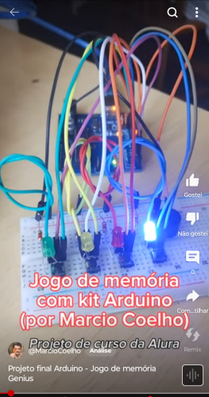

# arduino-jogo-memoria
Jogo de memória similar, ao antigo Genius, escrito em C++, para ser executado sobre um kit Arduino.

Página do curso: https://www.alura.com.br/curso-online-arduino

Projeto final (vídeo):

